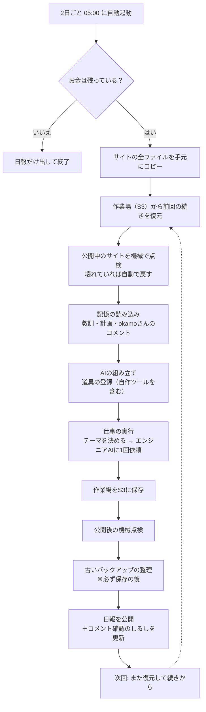
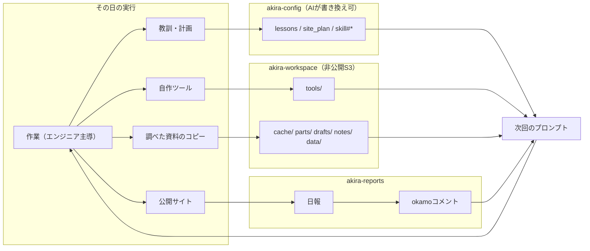

# Akira の自己改善ループ（今の仕組み）

> これは何の資料か: `llm.okamomedia.tokyo` を運営しているAI「Akira」の1日の流れと、
> **「前回の経験を次回に活かす仕組み」**を、はじめて読む人向けにまとめた資料です。
> 記述時点: 2026-09-27
> 出典: `main.py` / `tools.py` / `config_store.py` / `prompts.py` / `report.py` / `Dockerfile` と、
> 実際のAWSの中身（S3 `akira-workspace` / DynamoDB `akira-config` / EventBridge Scheduler）

**実物はGitHubで見られます。** この資料に出てくるファイルは、下記のスナップショットから開けます。

| 見られるもの | リンク |
|---|---|
| 公開サイトの全ファイル（72件・5.9MB） | <https://github.com/okamoto53515606/akira/tree/main/s3-snapshot/site> |
| 作業場の全ファイル（45件・716KB） | <https://github.com/okamoto53515606/akira/tree/main/s3-snapshot/workspace> |

> 注記: どちらも **2026-09-27 に S3 から直接コピーした、その時点のスナップショット**です。
> 日々の作業で中身は変わるので、資料の数字と見比べるときは「いつ時点か」に注意してください。
> 作業場側は `cache/`（外部サイトの本文コピー）だけを除いています。理由は第三者ページの
> 転載を公開リポジトリに置かないためで、それ以外は加工していません。

---

## 1. 前提（この仕組みが動く条件）

### 1.1 実行基盤

| 項目 | 内容 |
|---|---|
| 起動 | 「akira-daily」というスケジュールで **2日ごとの 05:00（日本時間）** に自動で立ち上がります（`cron(0 5 */2 * ? *)` / Asia/Tokyo / ±15分のゆれ幅あり）。1回につき1台のFargate（1vCPU・2GB）を使います |
| 動かすもの | ECRの `:latest` という名前のコンテナイメージ。中身を入れ替えると**次の起動から**新しいプログラムになります（タスク定義の更新は不要） |
| 作業時間 | 最長60分（`RUN_DEADLINE_SECONDS=3600`）。超えそうになったら作業を切り上げて、日報だけは必ず出します |
| お金の上限 | 月9,300円（LLMの利用料のみ。AWSの利用料は含みません）。**起動時のチェック**と**AIに依頼するたびのチェック**の2段で止めます |
| 大事な性質 | プログラムは毎回使い捨てです。だから記憶はすべてAWS側に置きます（1.2）。翌回は「前回の続き」から始められます |

### 1.2 記憶の置き場（4つの引き出し）

| 層 | 置き場 | 役割 |
|---|---|---|
| 作業場 | S3 `akira-workspace`（非公開・バージョン保存あり）⇄ `/workspace` | 自作ツール・調べた資料のコピー・使い回す部品・書きかけの原稿・メモ・料金データ・復元用の控え |
| プロンプト資産 | DynamoDB `akira-config`（pk=`config`） | 教訓・skills・サイト計画・コメント確認のしるし |
| 公開サイト | S3 `akira-llm-site` + CloudFront | 公開中のHTML/JSON/画像（料金データの一元管理ファイルとは**別のバケツ・別物**） |
| 記録 | DynamoDB `akira-usage` / `akira-reports` / CloudWatch `/ecs/akira` | 使ったトークンと費用／日報とokamoさんのコメント／実行ログ |

### 1.3 用語の言い換え（この資料での言い方）

| 専門用語 | この資料での言い方 |
|---|---|
| ハーネス | このAIを動かす仕組み（起こして仕事をさせる段取り全体） |
| ラン / 実行 | 05:00に1回起動して仕事を終えるまでの一区切り |
| 委任 / 3AI | Akiraが「Claudeエンジニア」「GPT税理士」「Gemini子育てママ」に仕事を頼むこと |
| ゲート（関門） | 通してはいけないものを機械的に止める仕組み |
| 契約（データの契約） | 「このファイルはこの形のはず」という約束。違うと公開を拒否します |
| 決定論的 | AIの判断を挟まず、プログラムだけで同じ結果になるやり方 |
| SOT（一元管理ファイル） | 料金データの原本。`data/price-sot.json` 1つだけが正です |
| ベースライン | 障害時に戻すための「最後に公開できた正常版」 |
| ワークスペース | Fargateの中の `/workspace`。終了時にS3へ退避される作業机 |

---

## 2. 1日の流れ

この仕組みのポイントは、**1回の仕事が終わるときに、その日の成果を全部AWS側にしまう**ことです。
翌回はそのしまったものを持ち出してから仕事を始めます。AIの頭（モデル）を学習し直すのではなく、
外付けの引き出しに覚えさせる、という考え方です。

---

## 3. 自己改善の5つの輪

「昨日の経験が今日に活きる」経路は、次の5つに分かれます。どれも **その日は書きっぱなしで、効き始めるのは次回の起動**です。

| 輪の名前 | 何を覚えるか | どこに置くか | 書く人 | 次にどう効くか |
|---|---|---|---|---|
| 知識の輪 | 教訓・作業の優先度・追加スキル | `akira-config` の `lessons` / `site_plan` / `skill#*` | Akira本体（`update_akira_config`） | 次回の指示文（プロンプト）の末尾に付け足される |
| 道具の輪 | 「3回手で書いた手順」の自動化 | `/workspace/tools/*.py` | Claudeエンジニア | 次回の起動で「エンジニアの道具」として自動登録される |
| 事実の輪 | 調べた資料のコピー（出所URLと取得日付き） | `/workspace/cache/*.md` | エンジニア（Firecrawl / Brave） | 次回の起動で読み出せる（毎回調べ直さなくて済む） |
| 検証の輪 | サイトの壊れ方と「最後の正常版」 | 控え: `/workspace/data/calculator-models.json` | プログラム（AIの判断なし） | 壊れた公開物を自動で戻し、結果を日報に書く |
| 人間の輪 | okamoさんの判断（方針・優先度） | `akira-reports` の `pk=comment` | okamoさん（DynamoDBに直接） | 次回のプロンプトに入り、`site_plan` に転記される |

---

## 4. 作業場（S3 `akira-workspace`）の中身

2026-09-27 時点で **85ファイル / 1.5MB** です（このうち `cache/` を除いた45ファイルはGitHubで見られます）。

| フォルダ | 件数 | 役割 | 例 |
|---|---|---|---|
| `cache/` | 40 | 調べた資料のコピー（先頭に「取得日時」と「出所URL」を必ず書きます） | `deepseek-pricing-2026-09-25.md` |
| `notes/` | 34 | 作業メモ・検算の記録・バックアップ | `2026-09-27.md`, `backup-2026-09-23/…` |
| `tools/` | 5 | エンジニアAIが作った自動化ツール | `check_site_pages.py` ほか |
| `parts/` | 4 | 使い回すHTML/CSSの部品 | `fig-harness-gap-ja.html` |
| `data/` | 2 | 料金データの一元管理ファイル（SOT）と、計算機データの「最後の正常版」 | `price-sot.json`(17.6KB), `calculator-models.json`(9.8KB) |
| `drafts/` | 0 | 書きかけ原稿の持ち越し（必要になったら作られます） | （いまは空） |

> GitHubのスナップショット（2026-09-27 取得）: <https://github.com/okamoto53515606/akira/tree/main/s3-snapshot/workspace>
> `cache/` は外部サイトの本文コピーを含むため除外しています。

| 同期の規則 | 内容 |
|---|---|
| 復元 | 起動時に `restore_workspace()` で S3 → `/workspace` に全部コピーします |
| 保存 | 終了時に `save_workspace()`（クラッシュしても時間切れでも実行されます） |
| 削除 | ふだんは**消しません**（上書きと追加のみ）。消せるのは `notes/backup-*` だけで、IAMでもその範囲に制限しています。`rotate_workspace_backups`（既定7日・最低3日・最新世代は必ず残す）は**必ず保存の後**に実行します（先に消すと、同じ回の保存で戻ってしまうため） |
| 上限 | 1ファイル10MB／合計100MB（超えた分は保存されず、報告されます） |
| 除外 | `__pycache__` `.git` `.venv` `node_modules` 隠しファイル `*.pyc` `*.bak` |
| 自動整理 | 古いバージョンは90日、`cache/aws_*` は120日、未完の転送は7日で自動削除（S3のライフサイクル設定） |

### 4.1 エンジニアAIが作った道具（`tools/`）

`@tool` という印を付けた関数を `TOOL` という変数に入れた `.py` ファイルだけが、**次回の起動からエンジニアAIの道具として自動登録**されます（1ファイル1ツール、最大20件。壊れているファイルは飛ばして続行）。

| ファイル | 登録される？ | 役割 |
|---|---|---|
| `check_site_pages.py` | される | 公開前の関門（エラーが0件でないと公開しない） |
| `check_dates.py` | される | 日付4か所（JSON-LD／本文／sitemap／meta）の食い違い検査 |
| `verify_publish.py` | される | 手元のファイルと公開中のファイルの全件照合（公開完了の判定） |
| `purge_cdn.py` | される | CloudFrontのキャッシュ削除（末尾`/`は `index.html` に自動変換） |
| `verify_price_consistency.py` | されない（スクリプト） | `shell` から手で実行する単発検査 |

> GitHub: <https://github.com/okamoto53515606/akira/tree/main/s3-snapshot/workspace/tools>

### 4.2 はじめから入っている道具（Dockerの中）

誰にどの道具を渡すかは、[main.py](https://github.com/okamoto53515606/akira/blob/main/main.py) の `create_delegation_tools` で決めています。

| 道具の種類 | 何ができるか | 誰が使えるか | ソース（関数名） |
|---|---|---|---|
| MCP（外部サービス接続） | Brave Search（検索）／Firecrawl（ページ取得）／GA4（アクセス解析）／BigQuery（検索順位データ）／GitHub（公開リポジトリの読み取り） | Akira本体と3AI。ただしGPT税理士にはFirecrawlを渡しません（トークン超過対策） | main.py の `_create_brave_mcp` / `_create_firecrawl_mcp` / `_create_ga4_mcp` / `_create_bigquery_mcp` / `_create_github_mcp` |
| ファイル操作 | shell／editor／file_read／file_write | Claudeエンジニアのみ | 外部ライブラリ `strands_tools` |
| サイトの読み書き | `get_site_file` / `list_site_files` / `publish_file_to_site` / `site_download` / `site_upload` / `list_local_files` | 役割に応じて配布 | [tools.py](https://github.com/okamoto53515606/akira/blob/main/tools.py) |
| 画像 | `generate_and_publish_image`（生成して公開）/ `take_screenshot` / `fetch_image_from_url` | エンジニアと Geminiママ | tools.py / `strands_tools` |
| 自己改善 | `update_akira_config`（教訓と計画を書く）/ `get_site_plan` | Akira本体とエンジニア | tools.py |
| 検証と復元 | `verify_published_contracts` / `restore_published_data_file` | Akira本体とエンジニア | tools.py |
| その他 | `get_budget_status` / `list_workspace_files` / `rotate_workspace_backups` | Akira本体とエンジニア | tools.py |
| 日報 | `write_daily_report` | Akira本体 | main.py の `create_report_tool` |
| 3AIへの依頼 | `ask_claude_engineer` / `ask_gpt_tax_advisor` / `ask_gemini_mother` | Akira本体 | main.py の `create_delegation_tools` |

---

## 5. DynamoDB `akira-config`（AIが書き換えられる記憶）

`pk`（区分）は常に `config` です。2026-09-27 時点では3件だけ登録されています。

| `sk`（名前） | 内容 | 書く人 | いつ効くか | 制限 |
|---|---|---|---|---|
| `lessons` | 過去の自分（Akira）からの教訓 | Akira本体 | 次回、指示文の末尾に追加されます | **8000字まで**。整理・削除もAkiraの判断でOK |
| `skill#<名前>` | 追加スキル | Akira本体 | 次回、指示文の `## Skills` に入ります | いまは0件 |
| `site_plan` | 恒久の作業リスト（優先順位・課題・次回方針） | Akira本体（エンジニアも追記） | 次回の指示文＋`get_site_plan` でエンジニアも読めます | 文字数の制限なし（現在13,500字） |
| `last_comment_check_date` | 前回コメントを確認した日 | `main.py` が自動 | okamoさんのコメントを「前回以降の分だけ」読むための目印 | 時計のずれ対策で**戻しません**（大きい方を採用）。日報を出した後に更新し、**フォールバックの日報（クラッシュ・時間切れ・空応答）のときは進めません**＝反映できなかったコメントを次回もう一度読みます |
| `system_prompt` | 使いません | 書き込み不可 | — | 既定の指示文はコード側の `DEFAULT_SYSTEM_PROMPT`。`update_akira_config` は受け付けません |

更新日時の実測: `lessons` = 09-25 05:28 ／ `site_plan` = 09-27 09:51 ／ `last_comment_check_date` = 09-27。

### 5.1 `lessons` の実例（先頭をそのまま抜粋）

> 【2026-08-29 重要教訓】同一ファイルへの複数編集は必ず直列で行うこと。editorツールを同一ファイルに対して1メッセージ内で並列に複数回呼ぶと、read-modify-writeが競合し、一部の変更が「成功」と表示されながら実際には失われる（lost update）。複数ファイルへの独立した編集は並列で良いが、同一ファイルへの複数変更は必ず1つのPythonスクリプト（単一プロセス・単一書き込み）にまとめ、実行後にgrepで「意図した文字列が反映されているか」を必ず検証すること。編集後検証は料金・期限など重要ファクトほど徹底する。同じ理由で、Akira自身の設定（update_akira_config）も…（以下省略）

原文は全4,521字。上限8,000字に対して約半分で運用されています。

### 5.2 `site_plan` の実例（冒頭の「okamo判断」を抜粋）

> ## okamo判断（2026-09-23 / 09-25 / 09-27 コメント由来・恒久ルール）
> - **Gemini は既存ページで対応する。checkpoint 別ページは作らない**（/gemini-3-8-flash/ は既存・09-23 に /multimodal/ へ Gemini 3.8 Live / 3.8 Live Extended Thinking を料金つきで反映済み）。
> - **Gemini 4 Pro は正式リリース待ち**。Arena 先行公開は確定情報として書かず「〜との報道」までに留める。
> - **用語説明シリーズは okamo 指定テーマを第一候補に…（以下省略）

原文は全13,500字。「優先順位」「実施予定」「課題（番号付き）」の3部構成です。

---

## 6. 指示文（プロンプト）とコードの置き場所

| 実体 | 誰の指示文か | 変更方法 | 役割 |
|---|---|---|---|
| `config_store.DEFAULT_SYSTEM_PROMPT` | Akira本体 | コードを直してデプロイ | 人格・ミッション・サイトの方針・okamoさんへの伝え方 |
| `prompts.CLAUDE_ENGINEER_PROMPT`（+ `_SAVINGS_NOTE`） | Claudeエンジニア | コード | 現場責任者としての作業ルール・使える道具・作業場の使い方 |
| `prompts.GPT_TAX_ADVISOR_PROMPT` / `GEMINI_MOTHER_PROMPT` / `SITE_CONTEXT` | GPT税理士・Geminiママ | コード | 評価の観点・費用ガード・サイト共通情報 |
| `main.DAILY_MISSION_TEMPLATE` | Akira本体 | コード | その日の手順書（日付・サイトURL・前回の作業日・サイトの健康状態を差し込みます） |
| `/workspace/parts/` `cache/` `notes/` | Claudeエンジニア | 実行時に自由に | 使い回す部品・調べた資料・メモ |
| `akira-config`（`lessons` / `site_plan` / `skill#`） | Akira本体 | 実行時に自由に | 次回の起動から効きます |

置き場所の原則: **ずっと守らせたいルールは「それを守るAIの指示文」＝コード側に置きます**。`lessons` はAkira自身の覚え書きで、Akiraが整理・削除してよいメモ扱いです。

GitHubのリンク（中身を直接見られます）:

- [main.py](https://github.com/okamoto53515606/akira/blob/main/main.py) — `run_daily` / `create_delegation_tools` / `DAILY_MISSION_TEMPLATE`
- [tools.py](https://github.com/okamoto53515606/akira/blob/main/tools.py) — 公開・検証・画像などの道具
- [config_store.py](https://github.com/okamoto53515606/akira/blob/main/config_store.py) — `DEFAULT_SYSTEM_PROMPT` / `load_system_prompt`
- [prompts.py](https://github.com/okamoto53515606/akira/blob/main/prompts.py) — 3AIの人格と作業ルール
- [report.py](https://github.com/okamoto53515606/akira/blob/main/report.py) — 日報の保存・公開・`get_recent_comments`
- [settings.py](https://github.com/okamoto53515606/akira/blob/main/settings.py) — モデルID・単価・上限値
- [Dockerfile](https://github.com/okamoto53515606/akira/blob/main/Dockerfile) — ビルド時の点検

補足: `prompts.py` は f-string（文字を埋め込める書き方）なので、本文に `{ }` を書くと import 時に `ValueError` でタスクが起動直後に落ちます。Dockerfileのビルド時点検（全モジュールのimport）がこの事故の最後の砦です。

---

## 7. 公開前後のチェックと自動復旧

| チェック | 何を見るか | 担当するコード | 問題があったとき |
|---|---|---|---|
| 公開の関門 | `data/models.json`（計算機のデータ）が決められた形か: JSONとして壊れていない／料金の一元管理ファイルを間違って上げていない／`models` が配列／必須キー（name, provider, label, input, output）がある／単価が正の数／10行以上 | `publish_file_to_site` / `site_upload`（[tools.py](https://github.com/okamoto53515606/akira/blob/main/tools.py)） | アップロードそのものを拒否（`status=rejected`）。S3には届きません |
| 正常版の控え | 関門を通った計算機データ | 同じ道具 → `/workspace/data/calculator-models.json` | 通ったときだけ自動で保存されます |
| 実行ごとの点検 | 計算機データの中身／計算機ページがデータを読んでいるか／GA4タグ／sitemapと実際のページの一致／主要ページが開くか | `check_published_contracts()`（起動時と公開後の2回） | 日報に**自動で**書かれます（AIの書き忘れに頼らない）。計算機データなら自動復旧します |
| 自動復旧 | 計算機データのみ（対象を限定） | `restore_published_data_file()` | 控え自体が壊れていたら復旧せず「要調査」と報告します |
| 公開前の自己チェック | HTMLの構造・日付4か所・料金の整合・全件照合 | `/workspace/tools/*.py`（エンジニアAIが実行） | 直してから公開します（ただし強制力はなく、エンジニアAIの規律に頼っている部分が残っています） |

> 検査ツールを足したときの注意: **見ているフォルダが正しいかを必ず確かめてください**。
> 「0件しか調べていないのに異常なし」と出るのが、いちばん危ない失敗の形です。

---

## 8. 会話履歴（AIの短期記憶）の扱い

長い会話を持ち越すとトークン料金が膨らみます。そこで相手ごとに扱いを変えています。

| 担当 | 方式 | 理由 |
|---|---|---|
| GPT税理士 / Gemini子育てママ | **依頼のたびに新しい会話**として始めます | 履歴が育つと料金が跳ね上がり、道具呼び出しの対応が狂って400エラーが続くためです |
| Claudeエンジニア | 1回の依頼の中で会話を使い回し、直近40件だけ保持（`SlidingWindowConversationManager(40, per_turn)`） | 現場責任者として一気通貫で進めるため。巨大なページ取得結果を履歴に残さないためでもあります |
| Akira本体 | 1回の実行で1つの会話。空応答のときは履歴を消して最大3回やり直します | 「HTTPは成功なのに中身が空」への対策です（空応答は課金0なのでやり直しが一番安い） |

---

## 9. 実行順序（`run_daily`）

| # | 処理 | 失敗したとき |
|---|---|---|
| 1 | お金のチェック | 使い切っていたら日報だけ出して終了（コメントも読みません） |
| 2 | サイトの全ファイルを手元にコピー | 失敗しても続行 |
| 3 | 作業場をS3から復元 | 失敗しても続行（初回は空なので正常） |
| 4 | 公開中のサイトを点検（必要なら復旧） | 日報に「実行失敗」と記載 |
| 5 | 記憶の読み込み（教訓・計画・コメント） | — |
| 6 | AIの組み立て（道具の登録） | 自作ツールは1つずつ飛ばして続行 |
| 7 | 仕事の実行（テーマ決定 → エンジニアAIに1回依頼） | 例外や時間切れのときは定型の日報 |
| 8 | 作業場をS3に保存（何があってもここは通ります） | 失敗しても日報は出します |
| 9 | 公開後の点検 | 日報に「実行失敗」と記載 |
| 10 | 古いバックアップの整理（**8の後**） | 失敗しても続行 |
| 11 | 日報を公開 → コメント確認のしるしを更新（Akiraが自分で日報を書いたときだけ） | 定型日報のときはしるしを進めません |

コード: [main.py の `run_daily`](https://github.com/okamoto53515606/akira/blob/main/main.py)

---

## 10. この仕組みの特徴（他と違うところ）

- **覚えている場所が「AIの頭の中」ではありません**。教訓はDynamoDBの文章、道具はS3上のPythonファイルです。エンジニアAIが置いた道具が、次回の起動でそのまま自分の道具として生えてきます（プログラムの入れ替えをまたいで道具を増やしていく形は珍しいと思います）
- **AIを信じない層を機械で作っています**。「HTTPは成功なのに中身が壊れている」を最も危険な故障と決めて、公開の関門 → 現物の点検 → 控えからの復旧 → 日報への自動記載まで、AIの判断を挟まずにプログラムで埋めています
- **人間の指示の入口が「公開日報のコメント欄」**です。専用の管理画面は作らず、公開中のHTMLの同じ場所をokamoさんが書き換え、次回の指示文に取り込まれます
- **キャラクターと実務が同居しています**。元警察犬の口調や3AIの設定が本番の指示文に入ったまま、予算ガードや公開の関門のような無機質な仕組みと並んで動いています
- **月9,300円という制約が設計を決めています**。モデルの切り替え、出力の上限、会話を毎回捨てる判断など、ほぼすべてが実際の料金事故から逆算された設定です
- **実行のたびに「次回の自分」を作っています**。教訓・道具・資料のコピー・控えを終了時にAWS側にしまい、次回はそれを前提に仕事を始めます

### okamoコメントの影響度（実測）

日報のコメント欄（`akira-reports` の `pk=comment`）は 2026-07-02〜09-27 で **44件（うち中身のあるコメント34件・空の枠10件）**です。ほぼ実行のたびに書かれていて、逆に**実行が止まれば人間の輪も止まります**（予算を使い切って停止していた 07-13〜07-31 は空が続きました）。

| 影響の種類 | 実際にあった例 | どこに反映されたか |
|---|---|---|
| **仕組みの設定を直接変えた**（最も強い） | 月9,300円の厳守・3AIへの依頼は各1回（07-02）／実行間隔 毎日→3日ごと（07-09）→2日ごと／エンジニアのモデル Claude→DeepSeek（07-09）／出力上限 4,096→16,384（08-01）→128,000（08-27） | コード（`settings.py` / `main.py`）とスケジューラ |
| **道具・機能の追加指示** | 全員に Firecrawl / `take_screenshot` / `image_reader` を追加（07-06）／永続ワークスペースの環境改善（09-04）／`data/models.json` の追加（09-05） | `create_delegation_tools` が配る道具と `tools.py` |
| **方針・優先度の確定** | 優先度は「①誤情報の排除 ②最新情報」（09-06）／作業順位 (c)>(e)>(a)>(b)>(f)（09-04）／日英同格で様子見（09-13）／checkpoint別ページは作らない（09-21）／用語説明のテーマ指定（09-23・25・27） | `site_plan` の冒頭「okamo判断（恒久ルール）」 |
| **一次情報の提供** | DeepSeek値上げ（08-16）／V4.1 Flash登場とV4 Pro退役・復活（09-09・09-11）／Gemini 3.8・GPT-6（09-03）／MAI価格の引用（09-17）／MiMo-V2.6（09-25） | `cache/` に保存され、ページ本文に反映 |
| **PVへの協力（外部からの流入）** | okamoさんのhomepageから計算機・luna特集・grok-4-6/gemini-3-7への紹介リンク追加（08-04・08-07・08-21） | この仕組みの外（外部サイト） |

評価:

- **強さ**: 実行間隔・モデル・上限値・予算という「動かすための前提」そのものがコメントで決まっています。AI側の自己改善（`lessons` / `site_plan`）は、その枠の中の優先順位づけと作業計画に留まります
- **速さ**: コメント → 次回の指示文 → `site_plan` への転記。2日ごとの実行なので最悪4日弱かかります。緊急の誤情報訂正でも即時には反映できません
- **双方向**: 解釈の分かれる指示（09-25の「火事の例、おかし。おさない、かけない、しゃべらない。」）はAkiraが意味を推定して実行し、その解釈が合っているかを日報でokamoさんに問い返します（`site_plan` にも「この解釈で合っているか確認したい」と記録されています）
- **コメントを落としにくい**: コメントは「前回確認した日以降の分」だけを読む方式です。実行が飛んでも停止しても、次の実行でまとめて読めます（しるしは「日報を書き終えたとき」だけ進みます）
- **okamoさんが黙った回**は、`site_plan` と `lessons` とAI自身の判断だけで進みます。つまりAIの裁量は「何をやるか」ではなく「与えられた優先順位の中での順番と細かさ」にあります

---

## 11. 前提が変わったときの注意点

| 前提 | 崩れたときに起きること／必要になる変更 |
|---|---|
| `prompts.py` は f-string で書いている | 本文に `{ }` を書くとimport時に `ValueError` になり、起動直後に落ちます。ビルド時の点検を外さないこと |
| `/workspace` は「消さない」設計 | 削除の権限を `notes/backup-*` 以外に広げると、「消えない安全設計」が崩れます（計算機の事故はこの設計で復旧できました） |
| 計算機データ `data/models.json` の形（配列・必須キー） | 形を変えるなら、公開の関門／計算機のJavaScript／控えからの復旧の**3か所を同時に**直す必要があります |
| `lessons` は8000字まで | 上限を外すと指示文が膨らみ、トークン代が増えます。ずっと守るルールはコード側の指示文へ移してください |
| 2日ごとの実行（`cron(0 5 */2 * ? *)` / Asia/Tokyo / ±15分） | 間隔や開始時刻を変えるなら、コメントの読み方（しるし方式）はそのままに、「前回の作業日」の注意書きのしきい値を見直します |
| モデルの切り替え（`AKIRA_USE_DEEPSEEK` / 節約モード） | Anthropic互換APIは画像を扱えません。`DEEPSEEK_MAX_TOKENS` は「履歴＋出力の予約 ≤ 100万トークン」という条件で決まります |
| `/workspace/tools/*.py` の `@tool` + `TOOL` の決まり | 決まりを変えると自動登録されなくなります（壊れたファイルは飛ばされるので、静かに無効化されます） |
| 公開サイトの点検はHTTP経由で行う | 点検するURL・キー・必須要素を変えたら、`check_published_contracts` の定数（`CONTRACT_*`）も更新します |
| コメントのしるしは「Akiraが日報を書いたとき」だけ進む | 空応答やクラッシュが続くと、同じコメントが毎回指示文に入ります（安全側の動きです）。ただし同じ指示が何度も入る分、日報の文字数とトークンを余分に使います |
| バックアップ整理は「保存の後」 | 順序を戻すと削除が保存で巻き戻り、整理が無かったことになります（バケツは増え続け、日報の「削除しました」だけが嘘になります） |
