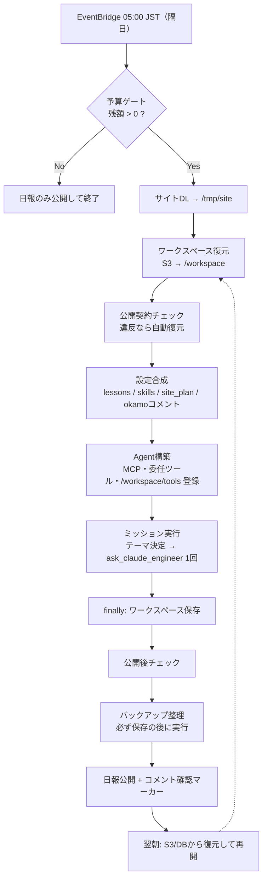
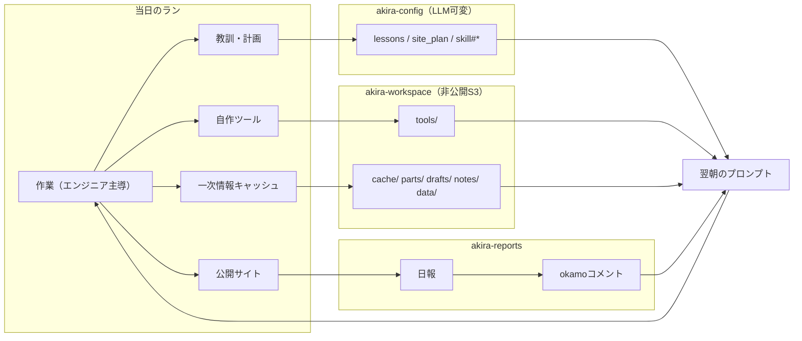

# Akira 自己改善ループ（現行設計）

> 対象: llm.okamomedia.tokyo 運営バッチ（ECS Fargate タスク `akira-daily`）
> 記述時点: 2026-09-27
> 出典: `main.py` / `tools.py` / `config_store.py` / `prompts.py` / `report.py` / `Dockerfile` と、
> 実リソースの実測値（S3 `akira-workspace` / DynamoDB `akira-config` / EventBridge Scheduler）

---

## 1. 前提

### 1.1 実行基盤

| 項目 | 内容 |
|---|---|
| 起動 | EventBridge Scheduler `akira-daily` = `cron(0 5 */2 * ? *)` / Asia/Tokyo / フレキシブル±15分（**隔日 05:00 JST**）/ Fargate 1タスク（1vCPU・2GB） |
| 実体 | イメージ `:latest` 参照（タスク定義・スケジューラの更新なしで反映される） |
| 壁時計上限 | `RUN_DEADLINE_SECONDS=3600`（SIGALRM。超過時は打ち切って日報だけ書く） |
| 予算 | 月額 `MONTHLY_BUDGET_JPY=9300` がハードリミット（LLM費用のみ）。日次300円は目安。**起動時の予算ゲート**＋**委任ごとの残額ガード**の2段 |
| 永続性 | プロセスは毎回使い捨て。状態はすべて AWS 側に置く（1.2） |

### 1.2 状態の置き場

| 層 | リソース | 役割 |
|---|---|---|
| 作業場 | S3 `akira-workspace`（非公開・バージョニング有効）⇄ `/workspace` | 自作ツール・一次情報キャッシュ・再利用パーツ・持ち越し原稿・メモ・料金SOT・ベースライン |
| プロンプト資産 | DynamoDB `akira-config`（pk=`config`） | 教訓・skills・サイト計画・コメント確認マーカー |
| 公開サイト | S3 `akira-llm-site` + CloudFront | 公開HTML/JSON/画像（SOT＝真実データとは別バケット・別物） |
| 記録 | DynamoDB `akira-usage` / `akira-reports` / CloudWatch `/ecs/akira` | 実測トークン・費用／日報本文とokamoコメント／実行ログ |

---

## 2. 1日の流れ

要点: **当日の出力物（教訓・ツール・キャッシュ・計画）はすべて実行終了時に耐久ストレージへ退避され、翌朝の起動時に読み戻されてから仕事が始まる**。学習は「モデルの重み」ではなく「外付けストレージ」に対して行われる。

---

## 3. 自己改善の環

| 環 | 何が学ばれるか | 書き込み先 | 実行主体 | 反映先 | 反映 |
|---|---|---|---|---|---|
| 知識環 | 教訓・作業優先度・追加スキル | `akira-config`: `lessons` / `site_plan` / `skill#*` | Akira本体（`update_akira_config`） | 翌朝のシステムプロンプトに合成 | 翌朝起動 |
| 道具環 | 「3回手で書いた手順」の自動化 | `/workspace/tools/*.py` | Claudeエンジニア | `load_workspace_tools()` がエンジニアのツールとして登録 | 翌朝起動 |
| 事実環 | 一次情報スナップショット（出典URL＋取得日時） | `/workspace/cache/*.md` | エンジニア（Firecrawl/Brave） | `list_workspace_files` + `file_read` | 翌朝復元 |
| 検証環 | 公開物の契約違反と正常版 | ベースライン `/workspace/data/calculator-models.json` | コード（決定論的） | 公開ゲート拒否・自動復元・日報への自動記載 | 同日／翌朝 |
| 人間環 | okamoの判断（方針・優先度） | `akira-reports` の `pk=comment` | okamo（DynamoDB直接） | マーカー差分でプロンプトに注入＋`site_plan` へ転記 | 翌朝起動 |

---

## 4. S3 `akira-workspace` の構造

実測（2026-09-27）: **85オブジェクト / 1.5MB**

| prefix | 件数 | 役割 | 例 |
|---|---|---|---|
| `cache/` | 40 | 一次情報スナップショット（先頭に取得日時・出典URLを必須記載） | `deepseek-pricing-2026-09-25.md`, `aws_faq.html` |
| `notes/` | 34 | 作業メモ・検算記録・世代バックアップ | `2026-09-27.md`, `backup-2026-09-23/…` |
| `tools/` | 5 | エンジニアが作った自動化ツール | `check_site_pages.py` ほか |
| `parts/` | 4 | 再利用するHTML/CSS断片・テンプレート | `fig-harness-gap-ja.html` |
| `data/` | 2 | 料金SOT（真実データ）と計算機データのベースライン | `price-sot.json`(17.6KB), `calculator-models.json`(9.8KB) |
| `drafts/` | 0 | 未完原稿の持ち越し（必要時に作られる） | （現在は空） |

| 同期の規則 | 内容 |
|---|---|
| 復元 | 起動時 `restore_workspace()` で S3 → `/workspace` に全件 |
| 保存 | 終了時 `finally` で `save_workspace()`（Akira本体クラッシュ・タイムアウト時も実行） |
| 削除 | 通常は **upsert-only**（消さない）。削除可は `notes/backup-*` のみ（IAMでも限定）。`rotate_workspace_backups`（既定7日・最低3日・最新世代は必ず残す）は**必ず `save_workspace` の後に実行**する（先に消すと、同じランの保存でS3へ復活してしまう） |
| 上限 | 1ファイル10MB／合計100MB（超過分は保存されず報告される） |
| 除外 | `__pycache__` `.git` `.venv` `node_modules` 隠しファイル `*.pyc` `*.bak` |
| ライフサイクル | 非現行 90日 ／ `cache/aws_*` 120日 ／ 未完MPU 7日 |

### 4.1 自作ツール（`tools/`）

`@tool` を付けた関数を変数 `TOOL` に代入した `.py` だけが、翌朝 **Claudeエンジニアのツールとして自動登録**される（1ファイル1ツール、上限20件、壊れたファイルはスキップして続行）。

| ファイル | 登録 | 役割 |
|---|---|---|
| `check_site_pages.py` | @tool | 公開前ゲート（ERROR 0 でなければ公開しない） |
| `check_dates.py` | @tool | 日付四点（JSON-LD／本文／sitemap lastmod／meta・og description）整合 |
| `verify_publish.py` | @tool | ローカルとライブの全件MD5照合（公開完了の判定） |
| `purge_cdn.py` | @tool | CloudFront invalidation（末尾`/`は`index.html`へ自動展開） |
| `verify_price_consistency.py` | なし（スクリプト） | `shell` から実行する単発検査 |

---

## 5. DynamoDB `akira-config` の構造

pk は常に `config`。実測（2026-09-27）の登録は3件。

| sk | 内容 | 書き手 | 反映先 | 制約 |
|---|---|---|---|---|
| `lessons` | 過去の自分（Akira）からの教訓 | Akira | システムプロンプト末尾に合成 | **8000字上限**。整理・削除もAkiraの裁量 |
| `skill#<名前>` | 追加スキル | Akira | システムプロンプトの `## Skills` | 現在0件 |
| `site_plan` | 恒久の作業リスト（優先順位・課題・次回方針） | Akira（エンジニアも追記） | プロンプト＋`get_site_plan` ツール（エンジニアも読める） | 文字数制限なし |
| `last_comment_check_date` | 前回コメント確認日 | `main.py` が自動 | okamoコメントの差分基点 | 時計ずれ対策で**後退させない**（max）。日報公開の後に更新し、**フォールバック日報（クラッシュ・デッドライン・空応答）のときは進めない**＝未反映のコメントを次回読み直す |
| `system_prompt` | 使用しない | 書込不可 | — | 既定部はコード管理 `DEFAULT_SYSTEM_PROMPT`。`update_akira_config` は reject する |

実測: `lessons` = 09-25 05:28 更新 ／ `site_plan` = 09-27 09:51 更新 ／ `last_comment_check_date` = 09-27。

---

## 6. プロンプト・コードの配置

| 実体 | 実行者 | 変更者 | 役割 |
|---|---|---|---|
| `config_store.DEFAULT_SYSTEM_PROMPT` | Akira本体 | コード（デプロイ） | 人格・ミッション・サイト方針・okamoへの伝え方 |
| `prompts.CLAUDE_ENGINEER_PROMPT`（+`_SAVINGS_NOTE`） | Claudeエンジニア | コード | 現場責任者としての作業規約・ツール・ワークスペース規約 |
| `prompts.GPT_TAX_ADVISOR_PROMPT` / `GEMINI_MOTHER_PROMPT` / `SITE_CONTEXT` | GPT税理士・Geminiママ | コード | 評価軸・費用ガード・サイト共通情報 |
| `main.DAILY_MISSION_TEMPLATE` | Akira本体 | コード | 当日の手順（`today` / `site_url` / `last_work_line` / `health_line` を注入） |
| `/workspace/parts/` `cache/` `notes/` | Claudeエンジニア | 実行時 | 再利用素材・一次情報・メモ |
| `akira-config`（lessons/site_plan/skill#） | Akira本体 | 実行時 | 実行中に書き換え、翌朝から有効 |

配置の原則: **恒久ルールは「そのルールを守る実行者のプロンプト」＝コード側に置く**。`lessons` はAkira自身の認知補助で、Akiraが整理・削除してよいノート。

補足: `prompts.py` は f-string で書かれているため、プロンプト本文に `{ }` を書くと import 時に `ValueError` でタスクが起動直後に落ちる。Dockerfile のビルド時 import 検品（全モジュール）がこの事故の最終防波堤になっている。

---

## 7. 公開ゲートと自動修復（検証環の実体）

| ゲート | 検査対象 | 実装 | 違反時 |
|---|---|---|---|
| 公開ゲート（物理） | `data/models.json` のデータ契約: JSON妥当／SOT混入なし／`models` が配列／必須キー（name, provider, label, input, output）／正の数値／10行以上 | `publish_file_to_site` / `site_upload` | `status=rejected`（S3に到達しない） |
| ベースライン保存 | 契約合格した計算機データ | 同ツール → `/workspace/data/calculator-models.json` | 合格時のみ自動保存 |
| 実行ごとの公開物検査 | 計算機データ／計算機ページの配線／GA4タグ／sitemapとHTML実体の一致／主要ページの疎通 | `check_published_contracts()`（起動時 1.7 と公開後の2回） | 日報に**自動記載**（LLMの書き忘れに依存しない）。計算機データなら自動復元 |
| 決定論的修復 | 計算機データのみ（許可キー限定） | `restore_published_data_file()` | ベースライン自体が違反なら復元せず報告 |
| エンジニアの事前チェック | HTML構造・日付四点・価格整合・MD5 | `/workspace/tools/*.py` | エンジニアが修正してから公開 |

検査系を追加したときの前提: **対象ディレクトリを正しく解決しているかを必ず確認する**（0件走査・別ディレクトリ走査は「異常なし」に見える最も危険な失敗）。

---

## 8. セッション（会話履歴）の扱い

| 担当 | 方式 | 理由 |
|---|---|---|
| GPT税理士 / Gemini子育てママ | **呼び出しごとに新規 Agent** | 履歴肥大による入力トークン爆発と、functionCall対応崩れによる400連発の防止 |
| Claudeエンジニア | 1回の委任で使い回し + `SlidingWindowConversationManager(40, per_turn)` | 現場責任者として一気通貫。巨大scrapeを履歴に残さない |
| Akira本体 | 1ミッション。空応答時は履歴クリアして最大3回再試行 | HTTP成功かつ本文・ツール呼び出し0件の「空ストリーム」対策（課金0なので再試行が最も安い） |

---

## 9. 実行順序（`run_daily`）

| # | 処理 | 失敗時の扱い |
|---|---|---|
| 1 | 予算ゲート | 超過なら日報のみ公開して終了（コメントは読まない・マーカーも動かさない） |
| 2 | サイトDL → `/tmp/site` | 失敗しても続行 |
| 3 | ワークスペース復元 → `/workspace` | 失敗しても続行（初回は空で正常） |
| 4 | 公開契約チェック（＋必要なら復元）→ `health_line` | 失敗は日報に「実行失敗」と記載 |
| 5 | 設定合成（`lessons` / `skills` / `site_plan` / okamoコメント差分） | — |
| 6 | Agent構築（MCP・委任ツール・`/workspace/tools` 登録） | ワークスペースツールは個別スキップ |
| 7 | ミッション実行（テーマ決定 → `ask_claude_engineer` 原則1回） | 例外・デッドライン時はフォールバック日報 |
| 8 | `finally`: ワークスペース保存 | 失敗しても日報公開は続行 |
| 9 | 公開後の契約チェック | 失敗は日報に「実行失敗」と記載 |
| 10 | バックアップ整理（**8の後**に行う） | 失敗しても続行 |
| 11 | 日報公開 → コメント確認マーカー更新（Akira本体が日報を書いたときだけ） | フォールバック日報時はマーカー据え置き |

---

## 10. このハーネスの特徴（他の実装と違う点）

- **学習が「重み」でも「ベクトルメモリ」でもない**。教訓はDynamoDBのテキスト、道具はS3上のPythonファイル。エンジニアが置いた `@tool` が翌朝そのまま自分のツールとして生えてくる（プロセス再起動をまたいだ道具の獲得）
- **LLMを信頼しない層を機械的に持つ**。「HTTP 200でも中身が壊れている」を最危険と定義し、公開ゲート（物理拒否）→ 現物検査 → ベースライン復元 → 日報への自動記載まで決定論的コードで埋めている
- **人間の入力経路が「公開日報のコメント欄＝DynamoDB直書き」**。認証付きUIを作らず、公開HTMLの同じ場所をokamoが書き換え、翌朝マーカー差分でプロンプトに注入される
- **ペルソナと実務が分離されていない**。元警察犬の口調と3AIの舞台設定が本番プロンプトに残ったまま、予算ガードや公開ゲートのような冷徹な機構と同居している
- **予算制約（月9,300円）がアーキテクチャを決めている**。モデル切替・max_tokens・Agent生成方針・履歴の捨て方がすべて実費事故から逆算されている
- **実行のたびに「翌朝の自分」を作る**。教訓・自作ツール・キャッシュ・ベースラインが終了時に耐久ストレージへ退避され、次回起動の前提として読み戻される

### okamoコメントの影響度（実測）

日報のコメント欄（`akira-reports` の `pk=comment`）は 2026-07-02〜09-27 で **44件（うち実質コメント34件・空プレースホルダ10件）**。ほぼ実行のたびに書かれ、逆に**実行が止まれば人間環も止まる**（予算超過で停止した 07-13〜07-31 は空が連続）。

| 影響の種類 | 実例 | 反映先 |
|---|---|---|
| **ハーネスの中核パラメータを直接変更**（最も強い） | 月予算9,300円厳守・3AIへの依頼は各1回（07-02）／実行間隔 毎日→3日毎（07-09）→隔日／エンジニアのモデル Claude→DeepSeek（07-09）／max_tokens 4096→16,384（08-01）→128,000（08-27） | コード（`settings.py` / `main.py`）とスケジューラ |
| **ツール・機能の追加指示** | 全員へ Firecrawl / `take_screenshot` / `image_reader`（07-06）／永続ワークスペースの環境改善（09-04 (f)）／`data/models.json` の追加（09-05） | `create_delegation_tools` の配布ツール・`tools.py` |
| **方針・優先度の確定** | 優先度は ①誤情報の排除 ②最新情報（09-06）／優先順位 (c)>(e)>(a)>(b)>(f)（09-04）／日英同格で様子見（09-13）／checkpoint別ページは作らない（09-21）／用語説明のテーマ指定（09-23・25・27） | `site_plan` 冒頭の「okamo判断（恒久ルール）」 |
| **一次情報の供給** | DeepSeek値上げ（08-16）／V4.1 Flash登場とV4 Pro退役・復活（09-09・09-11）／Gemini 3.8・GPT-6（09-03）／MAI価格の一次引用（09-17）／MiMo-V2.6（09-25） | `cache/` → ページ本文 |
| **PV協力（外部からの流入）** | okamoのhomepageから計算機・luna特集・grok-4-6/gemini-3-7 への紹介リンク追加（08-04・08-07・08-21） | ハーネス外（外部サイト） |

評価:

- **強度**: 実行間隔・モデル・上限値・予算という「動かすための前提」そのものがokamoコメントで決まっている。AI側の自己改善（`lessons` / `site_plan`）は、その枠内の優先順位づけと作業計画に留まる
- **速度**: コメント → 翌ランのプロンプト注入 → `site_plan` 転記。隔日実行なので最悪4日弱の遅延があり、緊急の誤情報訂正でも即時反映はできない
- **双方向**: 解釈が曖昧な指示（09-25「火事の例、おかし。おさない、かけない、しゃべらない。」）はAkiraが意味を推定して実行し、その解釈の正否を日報でokamoに問い返す（`site_plan` に「この解釈が合っているかをokamoに確認したい」と記録されている）
- **取りこぼし耐性**: コメントは固定日数ではなくマーカー差分で読む。実行が飛んでも・停止しても次の実行でまとめて読める（ただしマーカーは「日報を書き終えたとき」だけ前進する）
- **okamoが沈黙したラン**は `site_plan` と `lessons` と自己判断だけで進む。つまりAIの裁量は「何をやるか」ではなく「与えられた優先順位の中での順番と粒度」にある

---

## 11. 前提が変わったときの要注意事項

| 前提 | 崩れた場合に起きること／必要になる変更 |
|---|---|
| `prompts.py` は f-string | 本文に `{ }` を書くと import 時 `ValueError` → 起動直後クラッシュ。ビルド時 import 検品を外さないこと |
| `/workspace` は upsert-only | 削除権限を `notes/backup-*` 以外へ広げると「消えない安全設計」が崩れる（計算機事故はこの設計で復旧できた） |
| 計算機データ `data/models.json` の契約（配列・必須キー） | 形を変えるなら、公開ゲートの検証／計算機JS／ベースライン復元の**3点同時更新**が必要 |
| `lessons` は8000字上限 | 上限を外すとプロンプトが肥大し入力トークンが増える。恒久ルールはコード側プロンプトへ移す |
| 隔日実行（`cron(0 5 */2 * ? *)` / Asia/Tokyo / ±15分） | 実行間隔・開始時刻を変えるなら、コメントのマーカー方式は維持しつつ `last_work_line` の鮮度注意の閾値を見直す |
| モデル切替（`AKIRA_USE_DEEPSEEK`／節約モード） | Anthropic互換APIは画像ブロック非対応。`DEEPSEEK_MAX_TOKENS` は「履歴＋出力予約 ≤ 1M」の制約下で決まる |
| `/workspace/tools/*.py` の `@tool` + `TOOL` 規約 | 規約が変わると自動登録されない（壊れたファイルはスキップ＝静かに無効化される） |
| 公開サイトの契約検査はHTTP越し | 検査対象のURL・キー・必須要素を変えたら `check_published_contracts` の定数（`CONTRACT_*`）も更新する |
| コメントのマーカーは「Akira本体が日報を書いたとき」だけ前進 | 空応答・クラッシュが続くとコメントが毎回プロンプトに再注入される（意図どおりの安全側）。ただし同じ指示が何度も入るため、日報の文字数とトークンを余分に使う |
| バックアップ整理は「保存の後」 | 順序を戻すと削除が保存で巻き戻り、整理が無かったことになる（bucketは増え続け、report の「削除した」表示だけが嘘になる） |
